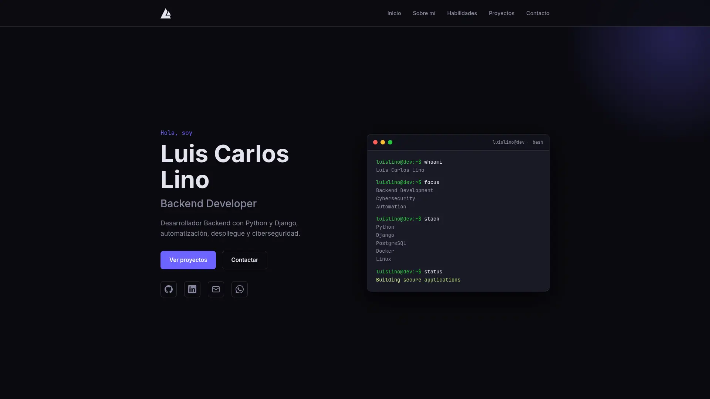

# luislinodev - Portafolio

Portafolio personal desarrollado con Astro para presentar mis proyectos, experiencia y enfoque en el desarrollo de software.

## Preview



## 🌐 Live Demo

**Sitio web:** https://luislino.dev

## ✨ Características

- Diseño responsive
- Alto rendimiento
- Optimizado para SEO
- Animaciones suaves
- Sección de proyectos
- Información de contacto

## 🛠️ Tecnologías

- Astro
- TypeScript
- HTML5
- CSS3
- JavaScript

## 📂 Estructura del proyecto

```text
src/
├── components/
├── data/
├── layouts/
├── pages/
└── styles/

public/
```

## 🚀 Instalación

Clona el repositorio:

```bash
git clone https://github.com/luislinodev/portfolio.git

cd portfolio

npm install

npm run dev
```

## 📦 Build de producción

```bash
npm run build
```

Para probar el build:

```bash
npm run preview
```

## 🧪 Verificación

```bash
npm run astro check
```
